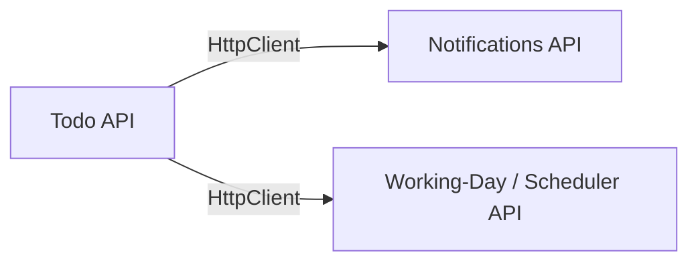

# Technical Requirement — Two Minimal APIs Called by the Todo API

Two standalone **.NET 8 Minimal API** services the intern builds independently, then wires
into the main Todo API through **typed `HttpClient`s** (`IHttpClientFactory`). They are chosen
so each one plugs into a real touch-point in the existing provider layer.



---

## Service 1 — Notifications API (`NotificationsApi`)

**Purpose:** the Todo API "sends" a notification when an item is completed or becomes overdue.
Good for practising fire-and-forget calls, `202 Accepted`, and graceful failure handling.

**Style:** Minimal API, in-memory `ConcurrentDictionary` store, no DB.

| Method | Route | Behaviour & responses |
|---|---|---|
| POST | `/api/notifications` | Body `{ channel, recipient, subject, message, referenceId }`. Valid → **202 Accepted** `{ id, status:"Queued" }`. Missing fields → **400**. Unsupported `channel` → **422**. `channel:"outage"` (or a configurable flag) forces **503** to exercise retries. |
| GET | `/api/notifications/{id}` | **200** `{ id, status, sentUtc? }` or **404**. Status is `Queued`→`Sent` (flip on read, keep simple). |
| GET | `/api/notifications?referenceId=` | **200** list of notifications for a given todo item id. |

**Contract types (documented, copied — no shared project):**
`SendNotificationRequest`, `NotificationResponse`, enum `NotificationStatus { Queued, Sent, Failed }`.

---

## Service 2 — Working-Day / Scheduler API (`SchedulerApi`)

**Purpose:** the Todo API calls it to compute/validate `DueUtc` (skip weekends + holidays) and to
flag items due on a holiday. Deterministic → easy to test.

**Style:** Minimal API, static in-memory holiday list from config, no DB.

| Method | Route | Behaviour & responses |
|---|---|---|
| GET | `/api/workingdays/next?from={date}&businessDays={n}` | **200** `{ from, businessDays, result }` — date `n` business days after `from`, skipping weekends + holidays. Bad/missing params → **400**. |
| GET | `/api/workingdays/is-holiday?date={date}` | **200** `{ date, isWeekend, isHoliday, name? }`. Invalid date → **400**. |
| GET | `/api/holidays?year={year}` | **200** list of configured holidays for the year. |

**Contract types:** `NextWorkingDayResponse`, `HolidayCheckResponse`, `HolidayDto`.

---

## Integration into the Todo API (the intern's second task)

### 1. Typed clients + config

`appsettings.json`:

```json
"Services": {
  "NotificationsApi": { "BaseUrl": "http://localhost:5240" },
  "SchedulerApi":     { "BaseUrl": "http://localhost:5228" }
}
```

`Program.cs`: `builder.Services.AddHttpClient<INotificationClient, NotificationClient>(c => c.BaseAddress = ...)`
and the same for `ISchedulerClient`. Set a short `Timeout`.

### 2. Client interfaces (live next to Providers)

- `INotificationClient`: `Task<NotificationResponse?> SendAsync(SendNotificationRequest req, CancellationToken ct)`.
- `ISchedulerClient`: `Task<DateTime> NextWorkingDayAsync(...)`, `Task<HolidayCheckResponse> IsHolidayAsync(...)`.

### 3. Where providers call them (reuse existing rules)

- `TodoItemProvider.Complete` → after marking complete, call `SendAsync` (completion notice).
  **Failure must NOT fail the completion** — log and continue (graceful degradation).
- `TodoItemProvider.Create` → call `IsHolidayAsync` on `DueUtc`; if it's a holiday, either reject
  (**422**) or return the next working day as a suggestion. Scheduler being down here **should**
  surface as a clear error (contrast with notifications).
- Overdue path (list stats or a `POST /api/items/{id}/remind` endpoint) → send an overdue notification.

### 4. Resilience & response-mapping rules the intern must implement

- Map `404` → `null`; treat non-success centrally.
- Add a retry/circuit-breaker via `Microsoft.Extensions.Http.Resilience` (`AddStandardResilienceHandler`)
  or Polly — this is what the `503` on the Notifications API exercises.
- Respect `CancellationToken`/timeout; handle `TaskCanceledException`.
- **Distinguish the two failure policies:** notifications = best-effort (swallow + log);
  scheduler validation = hard dependency (propagate as a business/`ProblemDetails` error).

---

## Deliverables per service

- Its own project + `Program.cs` + `*.http` file that tests every status code (200/202/400/404/422/503).
- README-style header comment listing base URL and endpoints.

## Verification

1. Run all three (`dotnet run` in each; or a `.sln`/compound launch). Note the two ports.
2. Exercise each minimal API standalone via its `.http` file.
3. From the Todo API: complete an item → notification appears (`GET /api/notifications?referenceId=`);
   create an item due on a holiday → 422/suggested date; stop the Scheduler API → confirm create
   fails cleanly; stop the Notifications API → confirm complete still succeeds.
4. Force `503` on notifications → confirm retry/circuit-breaker kicks in.

## Scope

**Included:** 2 minimal APIs (in-memory), typed `HttpClient` integration, config-driven base URLs,
resilience on one path, two contrasting failure policies, `.http` tests.

**Excluded:** databases in the sub-services, auth, service discovery, message queues, a shared
contracts NuGet package (contracts are copied for simplicity).

---

**Assumptions:** separate projects (no shared contract library), in-memory storage for both
sub-services, HTTP (not HTTPS) on localhost dev ports.